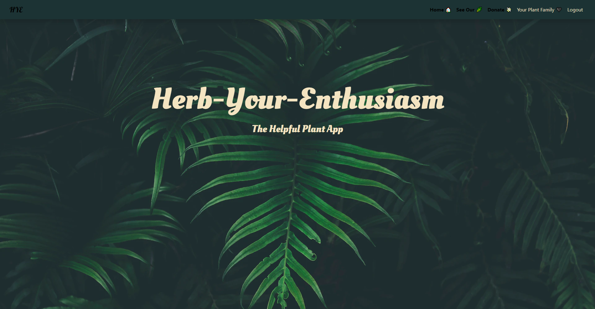
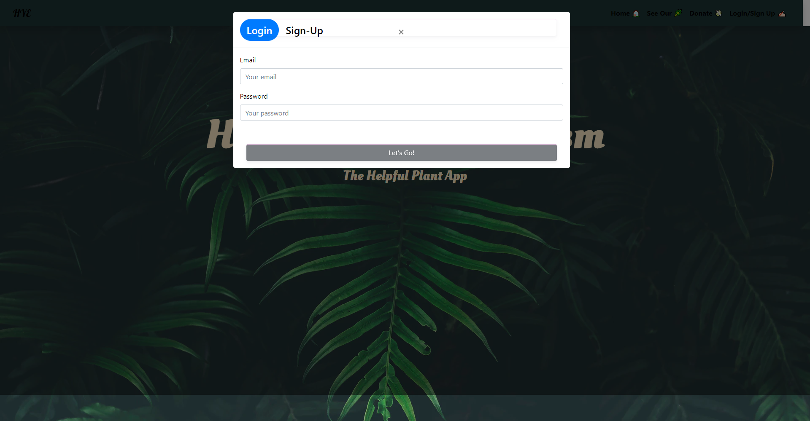
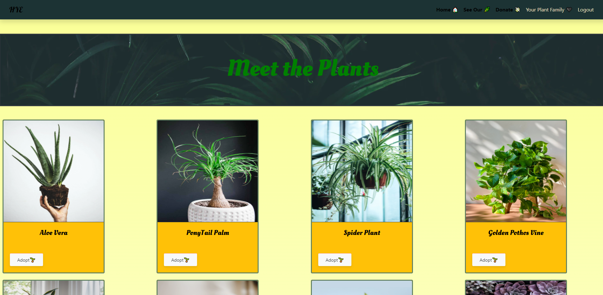
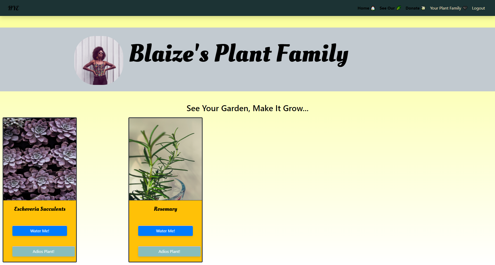
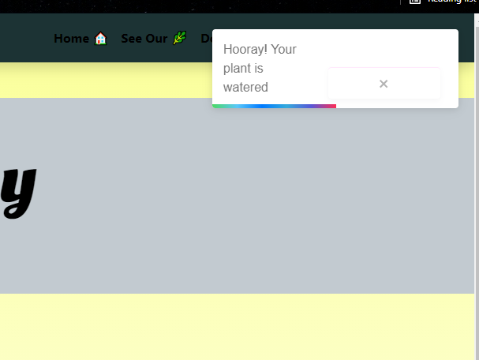

# Herb Your Enthusiasm

Your wonderful plants kept you company during the lonely time of covid but as the world gets back to 'normal' they are being a tad forgotten.

Herb Your Enthusiasm is an application that let's you choose from a plant selection to add to your personal garden family. It will send you reminders of when to water and give you a place to keep all of your plant information. Adopt your plant today!!

## Live Link:

* [Herb-Your-Enthusiasm](https://herb-your-enthusiasm.herokuapp.com/)

* [Github Repository](https://github.com/AnneliseRowan/herb-your-enthusiasm)

* [PowerPoint Presentation](https://docs.google.com/presentation/d/1X5d4LeNx26EZwlTToezmOKVmtw8DP8-LFU35_jefjqo/edit#slide=id.gdfc234873b_0_1936)

## User Stories

* As a user, I want to view the plants within the garden database.

* As a user, I want to adopt plants to my garden database.

* As a user, I want to receive notifications based on individual plant's watering need.

* As a user, I want to be met with a friendly UI.


## DEMO

### This is the welcome page of Herb-Your-Enthusiasm.



### This is the login modal that will popup when you click login




### You can browse our current plants to choose one or many to adopt



### The user profile page presents with a picture and welcome sign



### Notifications are sent depending on what plants are added to the garden



### A donation page if you are feeling so inclined :)


## Technology Used

```
Sequelize

MongoDb

Node.js

Express.js

React.js

Heroku

Mongoose

React Bootstrap

CSS

Toastify (NPM React Package)

GraphQL

Apollo

```


## Contributors:

* [James Antley](https://github.com/Jimmant91)

* [Alexis Ligon](https://github.com/alexisligon)

* [Jonathan Nance](https://github.com/speakeasyman)

* [Annélise Rowan](https://github.com/AnneliseRowan)
